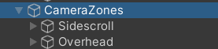
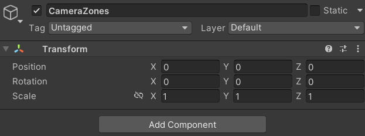
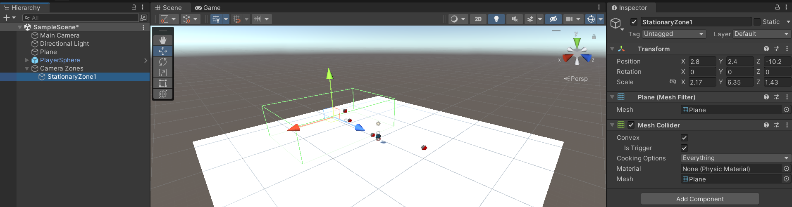
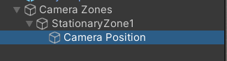
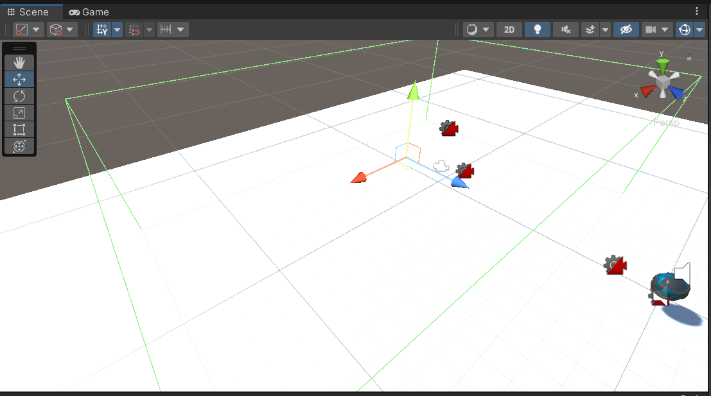
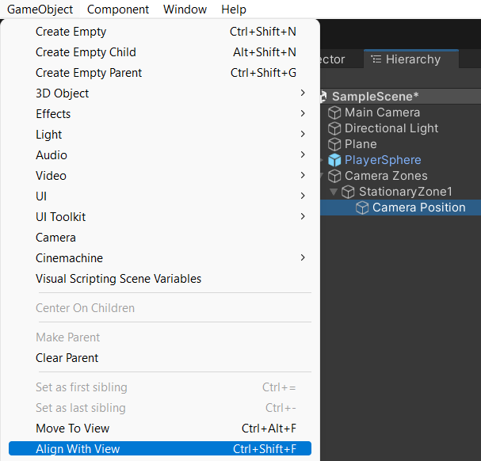
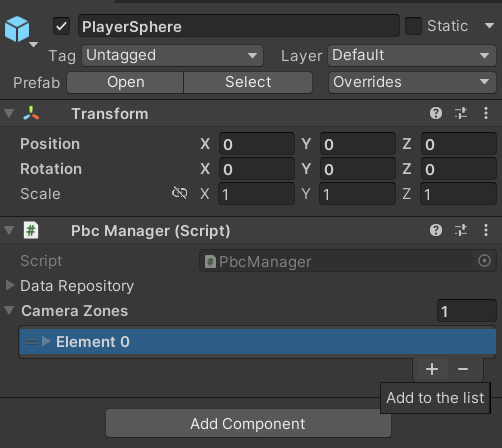
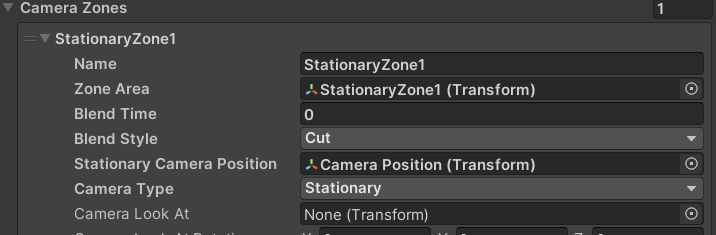

#Create Camera Zones

There are multiple ways you could create camera zones.  This is just an example of how I like to do it.  This guide will show you how to setup a stationary camera zone.

## 1.  Create The Zone Object

1.  Begin by creating a empty game object called Camera Zones.  This will keep all of your zones nice and neat. 

2.  Remember to zero out your empty game object if not already done. 

3.  Add a plane to your Camera Zones, rename it to something meaningful
4.  Remove the mesh renderer component from the plane
5.  Change the mesh collider to convex and check the is trigger box
6.  Scale and position the plane in your scene, if the player is anywhere inside the trigger the zone will be active
7.  You should now have a scene without a layout like this.  Obviously your scene will look different. 

8.  Add a new empty gameobject with your zone as the parent, named **Camera Position** 

9.  In your scene view, position your view to how you would like the camera to look.  In this example I zoomed in on the zone, with a slight overhead view 

10.  Select the **Camera Position** game object, then select game object->Align With View from the File Menu

## 2.  Assign The Zone Object To The Prime Ball Controller
1.  Go to your PlayerSphere object and find Camera Zones under the Pbc Manager script component
2.  Click the plus sign to add a zone.  You should now see 1 item in your list named Element 0.  Expand Element 0 to display the configuration options. 

3.  Give the zone a name
4.  Drag the zone plane you created back in section 1 step 3 into the Zone Area
5.  Drag the zone camera position you created back in section 1 step 8 into the Stationary Camera Position
6.  Change the **Camera Type** to **Stationary**
7.  Your finished zone should look something like this<br/.>

Your zone is finished.  Continue on to the next section for an explanation of each zone option.