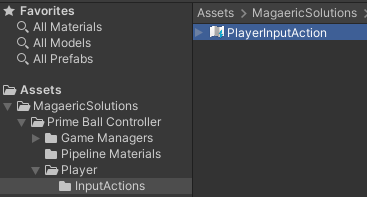

#Input Mapping

Prime Ball Controller uses the new Input System package.  An **Input Action Asset** has already been configured for you and has 2 Control schemes supporting both Keyboard / Mouse and Gamepad.  The Player Input Action can be found at: 
**Assets->MagaericSolutions->Prime Ball Controller->Player->InputActions->PlayerInputAction**

 

If you open the PlayerInputAction, you can easily modify the controls.  If you need extra help modifying the controls, check out the [Unity Documentation on Input Action Assets](https://docs.unity3d.com/Packages/com.unity.inputsystem@1.0/manual/ActionAssets.html)

The default controls are:

**Move** - WASD

**Jump** - Space

**Magnet Climb** - Hold Right Mouse Button

**Sprint** - Hold Left Mouse Button

**Boost** - Hold Middle Mouse To Charge, Release To Boost

**Free Look Camera** - Hold Left Mouse Button, and Move Mouse

**FPS Camera** - Hold Right Mouse Button, While Stationary and Move Mouse

**Projectile Camera** – Hold left shift

**Fire projectile** – Left mouse button while projectile camera is active

**Boost Jump** – Middle mouse button while projectile camera is active

**Grapple** – Right mouse button while projectile camera is active

