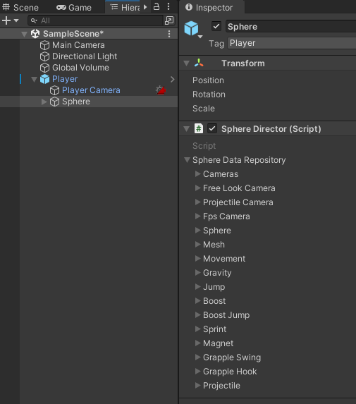

# Controller Options Overview

The options to control the sphere are all located within a single location to make it easier to find what you need to change.  They can all be found on the Sphere Director script component
 that is attached to the Player->Sphere object, under Sphere Data Repository. 
 
 
 
 
 They include:
 
- Cameras
- Free Look Camera
- Projectile Camera
- Fps Camera
- Sphere
- Mesh
- Movement
- Gravity
- Jump
- Boost
- Boost Jump
- Sprint
- Magnet
- Grapple Swing
- Grapple Hook
- Projectile

Use the TOC for detailed information about each option.  They also have tooltips in the editor to explain their purpose.