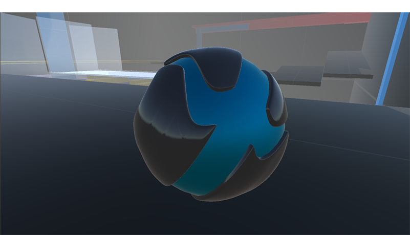

# Welcome

[Download from the Unity Asset Store](https://assetstore.unity.com/packages/tools/physics/prime-ball-controller-229154){:target="_blank"}

[Playable WebGL Demo](http://primeballcontroller.com/demo){:target="_blank"}

Welcome to the official documentation and demo site for the Prime Ball Controller, built with the Unity game engine.  The idea for this controller began with a personal project to try and create a Metroid Prime styled game.  The first mechanic I wanted
to implement was the ball.  I figured I would just hop over to the asset store and purchase something that seemed to fit my project.  After realizing there wasn't anything that was even close to what I wanted,  I decided to create it myself.  After I finished
the controller, I wanted to make it available to others to hopefully inspire similar games.  It's not perfect but accomplishes the goals I set for it.  The controller works great for for a wide variety of 3d genres such as puzzle, sidescroller,
 fps / 3rd person, adventure, etc.  It was designed to be very simple to use but with a vast array of options to customize it to your liking.

 