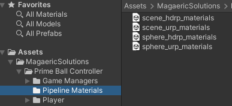

# Using Different Render Pipelines (Built-In, URP, HDRP)

The Player Prefab and the demo scenes that come by default were made for the Built-In render pipeline.  If you need to use URP or HDRP just import the scene and sphere material packages for your pipeline located at **Assets->MagaericSolutions->Prime Ball Controller->Pipeline Materials**.  
 

