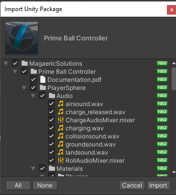

## Detailed Installation Directions
This guide assumes you are new Unity user and will be somewhat painful for experienced users.  If you know what you are doing, use the [Basic Installation Guide.](../basic-installation)

### 1.) Import the Prime Ball Controller Package

1.  Select **Window->Package Manager** from the File Menu. 

1.  Change the Packages drop down to My Assets. 

2.  Find Prime Ball Controller in the list and select **Download**.  If you don't see the package, make sure you have already purchased it from the Unity Asset Store. 

3.  After the download is complete, select **Import** 

4.  If a warning pops up about dependencies.  Select **Install/Upgrade** it's just alerting you that Cinemachine and the Input System will be installed automatically.  If you select Skip, you must manually install Cinemachine and the Input System. 

5.  If another warning pops up about the new input system package.  Select **Yes**.  This just means the old default legacy input system will be disabled and the new system enabled. **This will cause Unity to exit and reload.** 

6.  After Unity opens back up, go back to your package manager and Import the Prime Ball Controller again, Another window will open where you can select **Import** again. 

### 2.) Add the Player prefab to your scene

1.  Find the Player prefab in your project located at **Assets->MagaericSolutions->Prime Ball Controller->Prefabs**. 

2.  Drag the Player prefab into your scene.

### 3.) Delete the Main Camera in your scene.  
**If your project is already using Cinemachine and you need to keep your existing Main Camera / Cinemachine Brain, 
[follow these steps](../installation-previous-cinemachine).  Otherwise, continue with this guide.**

1.  Find the Main Camera in your scene 

2.  Select it and press delete

Your Prime Ball Controller in now ready to use.  Add something for your ball to roll around on and give it a try.  Check the [Input Mapping Page](../../controller_options/input-mapping) for the default controls and directions to change them.