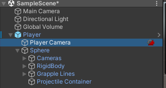
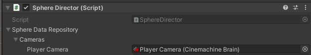

# Setup With Existing Cinemachine

If you are already using Cinemachine and want to keep your existing Camera Brain, you will need to make one adjustment to the Player object.

1.  Remove the Player Camera from the Player Object located at **Player->Player Camera** 

2.  Select the Player Object and then select Sphere
3.  Expand the Sphere Data Repository then expand Cameras.  Drag your Main Camera into the Player Camera Position.

That's it.  However, if you plan on using local multiplayer, it is recommended to keep the cameras as is.  The main camera must be on the Player if you want to use the local multiplayer feature.