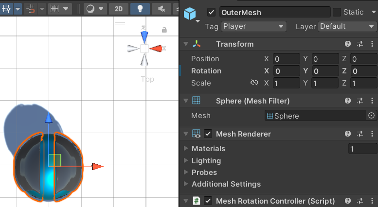
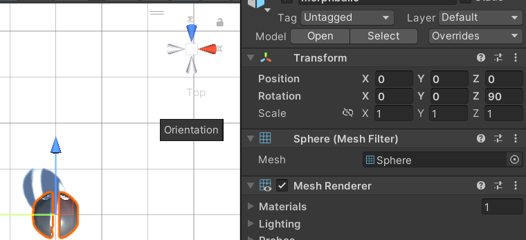
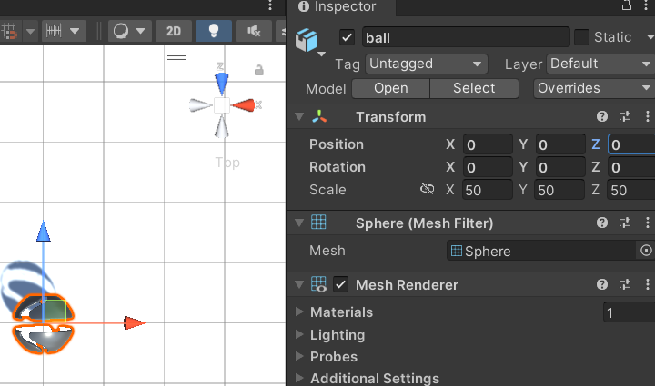

#Using Your Own Mesh

To use your own custom sphere mesh, you just need to replace the outer mesh object with your mesh.  However, there is an important step if your sphere has a forward direction as is the case with the
default sphere.  If you used something like a soccer ball where there is no obvious orientation you don't need to worry about this.  This issue comes from the rotation of the sphere.  When exporting from
Blender, it can be tricky to get the correct rotation.  When you import into Unity, your object must face forward on the Z axis with no rotation applied to the mesh.  See below for examples.

1.  The correct orientation.  In this example, with a top down view you can see the sphere is pointing toward the Z axis with no rotation applied 
  
2.  Incorrect Way 1.  In this example, the sphere is pointing toward the Z axis, but a 90 degree rotation on the Z axis was needed to do that.  This will not work. 
  
3.  Incorrect Way 2.  In this example, the rotation is set to 0, but the sphere is not pointing in the Z axis.  This will not work. 
  
